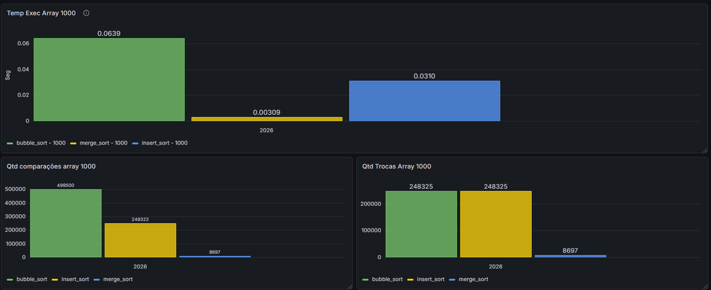
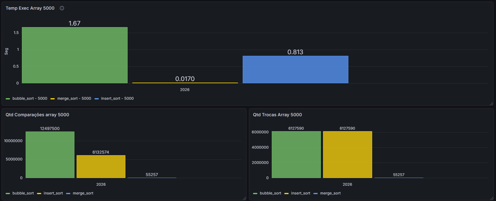
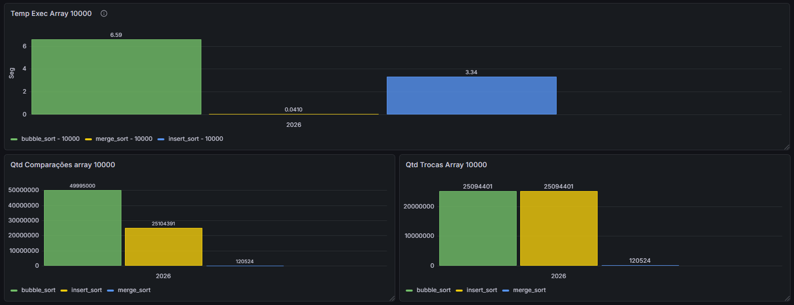
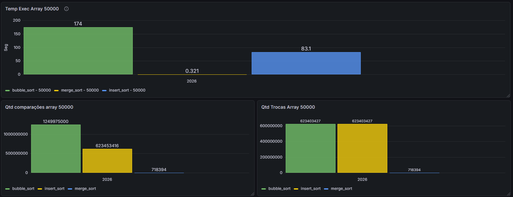
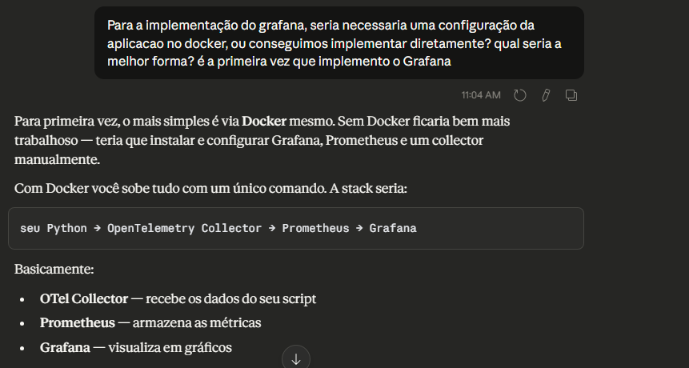
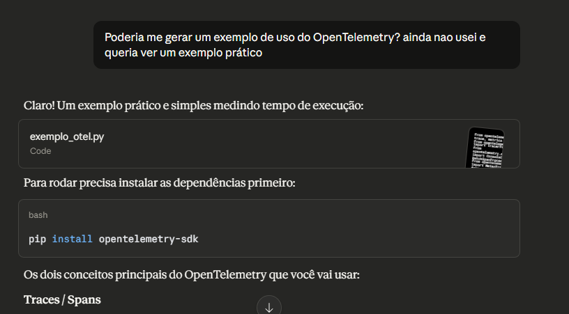
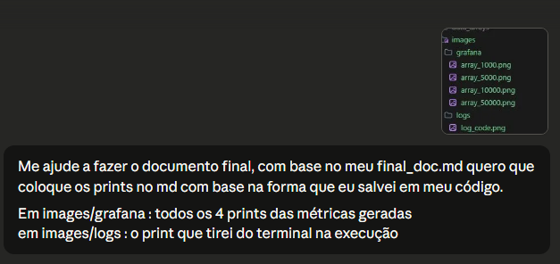

# Relatório Técnico — N1
## Implementação, Instrumentação e Análise de Algoritmos de Ordenação

**Aluno:** Kalebe Fukuda de Oliveira

**Disciplina:** Análise de Algoritmos  
**Data:** 27/03/2026

---

## 1. Introdução

Este relatório documenta a implementação de três algoritmos de ordenação, sua instrumentação com OpenTelemetry e Prometheus, a visualização dos dados no Grafana e a análise crítica dos resultados obtidos a partir de execuções reais com arrays de diferentes tamanhos.

O objetivo não foi apenas implementar os algoritmos, mas analisar a teoria de complexidade com o comportamento real medido, utilizando ferramentas de observabilidade.

---

## 2. Algoritmos Implementados

### 2.1 Bubble Sort — O(n²)

Compara elementos adjacentes dois a dois e os troca se estiverem fora de ordem. Repete o processo até o array estar ordenado. A cada passagem, o maior elemento vai para o final.

- **Estável:** Sim
- **In-place:** Sim

### 2.2 Insertion Sort — O(n²)

Constrói o array ordenado um elemento por vez. Pega o elemento atual e o insere na posição correta dentro da parte já ordenada, deslocando os elementos maiores para a direita.

- **Estável:** Sim
- **In-place:** Sim

### 2.3 Merge Sort — O(n log n)

Divide o array ao meio recursivamente até restar elementos individuais, depois une os pares de forma ordenada no caminho de volta da recursão.

- **Estável:** Sim
- **In-place:** Não (usa memória extra)

---

## 3. Geração e Padronização dos Dados

Os arrays foram gerados uma única vez com o script `generator_array_csv.py`, salvos em arquivos CSV na pasta `data_arrays/`, e reutilizados por todos os algoritmos em cada execução.

| Arquivo | Tamanho |
|---|---|
| array_1000.csv | 1.000 elementos |
| array_5000.csv | 5.000 elementos |
| array_10000.csv | 10.000 elementos |
| array_50000.csv | 50.000 elementos |

---

## 4. Instrumentação com OpenTelemetry

A instrumentação foi feita no arquivo `run_sorts.py` utilizando:

- **OpenTelemetry SDK** — para traces e spans
- **Prometheus Client** — para exposição de métricas

### Métricas coletadas

| Métrica | Descrição |
|---|---|
| `sort_execution_time_seconds` | Tempo de execução em segundos |
| `sort_comparacoes_total` | Número de comparações realizadas |
| `sort_trocas_total` | Número de trocas realizadas |

### Logs registrados

- Início de cada execução com algoritmo e tamanho do array
- Fim da execução com tempo, comparações e trocas
- Erros e exceções com stack trace

### Atributos dos spans

Cada span registra: `algorithm`, `input.size`, `execution_time_s`, `comparacoes`, `trocas`.

---

## 5. Ferramenta de Observabilidade

### Escolha: Grafana + Prometheus

**Por que Grafana?**
- Integração nativa com Prometheus
- Interface visual intuitiva para criação de dashboards
- Amplamente utilizado em ambientes profissionais de engenharia de software

**Por que Prometheus?**
- Coleta métricas via scrape HTTP — compatível com o `prometheus_client` do Python
- Modelo de dados orientado a séries temporais com suporte a labels, permitindo filtrar por algoritmo e tamanho de array

### Configuração

A stack foi configurada via Docker Compose com três serviços:

- **OTel Collector** — recebe traces via OTLP HTTP (porta 4318)
- **Prometheus** — coleta métricas do script Python (porta 8000) a cada 5 segundos
- **Grafana** — conectado ao Prometheus, exposto na porta 3000

---

## 6. Experimentos e Resultados

Todos os algoritmos foram executados sobre os mesmos arrays, nos mesmos tamanhos, na mesma ordem.

### 6.1 Array 1.000 elementos

| Algoritmo | Tempo | Comparações | Trocas |
|---|---|---|---|
| Bubble Sort | 0,0639s | 499.500 | 248.325 |
| Insert Sort | 0,0310s | 249.322 | 248.325 |
| Merge Sort | 0,00309s | 8.697 | 8.697 |

---

### 6.2 Array 5.000 elementos

| Algoritmo | Tempo | Comparações | Trocas |
|---|---|---|---|
| Bubble Sort | 1,67s | 12.497.500 | 6.127.590 |
| Insert Sort | 0,813s | 6.132.574 | 6.127.590 |
| Merge Sort | 0,0170s | 55.257 | 55.257 |

---

### 6.3 Array 10.000 elementos

| Algoritmo | Tempo | Comparações | Trocas |
|---|---|---|---|
| Bubble Sort | 6,59s | 49.995.000 | 25.094.401 |
| Insert Sort | 3,34s | 25.104.391 | 25.094.401 |
| Merge Sort | 0,0410s | 120.524 | 120.524 |

---

### 6.4 Array 50.000 elementos

| Algoritmo | Tempo | Comparações | Trocas |
|---|---|---|---|
| Bubble Sort | 174s | 1.249.975.000 | 623.403.427 |
| Insert Sort | 83,1s | 623.453.416 | 623.403.427 |
| Merge Sort | 0,321s | 718.394 | 718.394 |

---

## 7. Análise Crítica

### Os resultados confirmaram a teoria?

Sim, em grande parte. O Merge Sort se manteve consistentemente mais rápido em todos os tamanhos, confirmando sua complexidade O(n log n). O Bubble Sort e o Insertion Sort cresceram de forma quadrática, conforme esperado pelo O(n²).

O dado mais evidente: ao passar de 1.000 para 50.000 elementos (50x mais dados), o Bubble Sort demorou ~2.700x mais — exatamente o comportamento esperado de O(n²), onde duplicar o tamanho quadruplica o tempo.

### Onde a teoria não explica totalmente o comportamento real?

O Insertion Sort, apesar de ter a mesma complexidade O(n²) que o Bubble Sort, foi consistentemente cerca de 2x mais rápido. A teoria trata os dois como equivalentes, mas na prática o Insertion Sort faz menos trabalho: ele para de comparar assim que encontra o lugar certo, enquanto o Bubble Sort sempre percorre o array inteiro.

Isso se confirma nos dados de comparações: com 10.000 elementos, o Bubble Sort fez 49,9 milhões de comparações contra 25,1 milhões do Insertion Sort.

### Quando um algoritmo teoricamente pior teve desempenho aceitável?

Para arrays de 1.000 elementos, o Bubble Sort executou em apenas 0,063 segundos — tempo imperceptível para o usuário. Para entradas pequenas, a constante escondida no Big-O não importa, e algoritmos simples como Bubble Sort ou Insertion Sort são perfeitamente aceitáveis.

### Que fatores além do Big-O influenciaram os resultados?

- **Localidade de cache:** o Insertion Sort acessa memória de forma mais sequencial que o Bubble Sort, aproveitando melhor o cache do processador
- **Número real de operações:** o Big-O ignora constantes, mas na prática o Bubble Sort faz o dobro de comparações que o Insertion Sort para os mesmos dados
- **Overhead do Python:** o Merge Sort usa `pop(0)` internamente, que é O(n) em listas Python — isso explica por que o Merge Sort em arrays maiores não foi tão rápido quanto poderia ser com uma implementação usando índices

### O que você não teria percebido sem observabilidade?

Sem o Grafana e as métricas de comparações e trocas, seria impossível perceber que o Bubble Sort e o Insertion Sort realizam exatamente o mesmo número de trocas. Isso revela que ambos movem os elementos a mesma quantidade de vezes — a diferença de velocidade vem das comparações extras que o Bubble Sort faz, não das trocas.

Também não seria visível que o Merge Sort, apesar de muito mais rápido, faz o mesmo número de comparações e trocas — confirmando que sua eficiência vem da divisão recursiva, não de operar com menos dados.

---

## 8. Uso de IA

A IA (Claude) foi utilizada como ferramenta de apoio ao longo de todo o projeto.

**Onde ajudou:**
- Configuração da stack Docker com Grafana, Prometheus e OTel Collector
- Implementação da instrumentação com `prometheus_client` após falhas no exporter OTLP
- Adição dos contadores de comparações e trocas nos algoritmos
- Criação de Documentação
- Estruturação de passos do projeto
- Entender todas as tecnologias usadas, pois não havia nunca usado antes

**Onde foi necessário corrigir ou decidir sozinho:**
- A IA sugeriu inicialmente o `OTLPMetricExporter` para enviar métricas, mas ele não funcionou no ambiente Windows com Docker — foi necessário trocar para o `prometheus_client` com endpoint HTTP direto
- A estrutura de pastas (`sorts/bubble_sort/bubble_sort.py`) foi uma decisão própria, não sugerida pela IA
- A escolha de quais métricas eram relevantes para o relatório partiu da leitura crítica dos dados, não da IA
- O Códigos de Sorts foi implementação própria

**Onde a IA foi superficial:**
- Na configuração de ambientes, tive problemas, pois estava com erro no OTL e as métricas não estavam sendo obtidas para o dashboard no Grafana

### Evidências de uso da IA

**Configuração do Grafana**

**Instrumentação com OpenTelemetry**

**Geração de documentação Markdown**

---

## 9. Código Fonte

O código fonte completo está disponível no repositório:

🔗 [github.com/kalebefukuda/sort-algorithm](https://github.com/kalebefukuda/sort-algorithm)

---

## 10. Conclusão

Este trabalho demonstrou que teoria e prática de algoritmos são complementares, mas não equivalentes. O Big-O é uma ferramenta poderosa para prever comportamento assintótico, mas oculta constantes, padrões de acesso à memória e características específicas de implementação que só aparecem com medição real.

Com OpenTelemetry, Prometheus e Grafana permitiram análises precisas e reais sobre o funcionamento e comparação entre os algoritmos dado a entrada de dados.